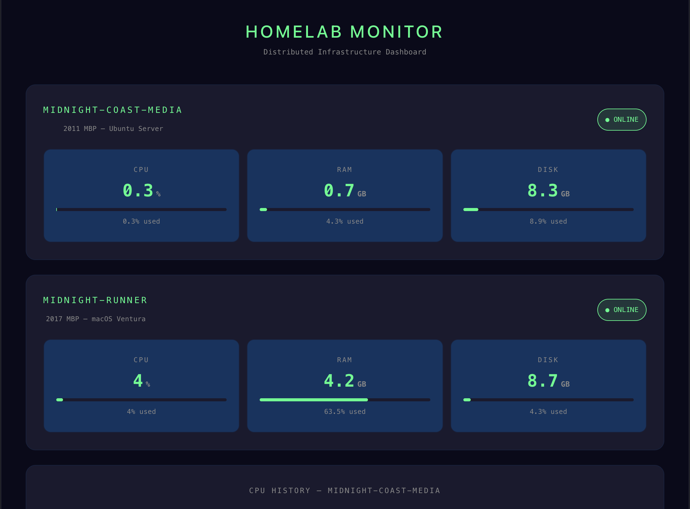
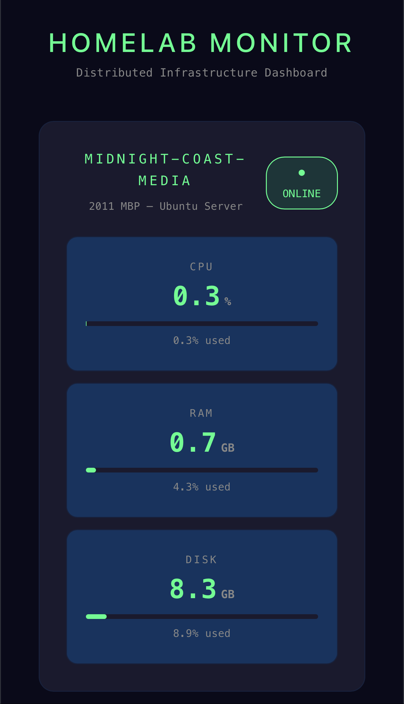
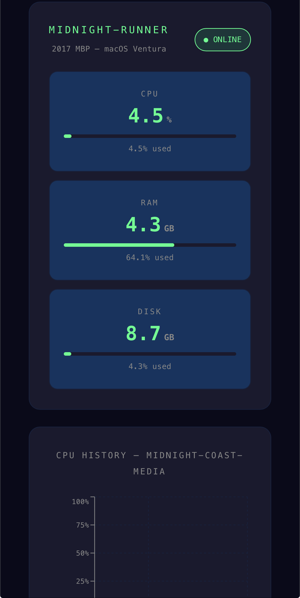

# Homelab Monitor

A self-hosted distributed infrastructure monitoring dashboard built on a 3-node homelab environment.

Tracks real-time system metrics (CPU, RAM, disk) across multiple nodes and displays them on a live web dashboard — accessible from anywhere via Tailscale VPN.

> Built as a portfolio project while pursuing AWS Cloud Associate certification.

---

## Live Demo

🔗 [homelab-monitor-zeta.vercel.app](https://homelab-monitor-zeta.vercel.app)





---

## Architecture


M4 MacBook Air (Dev)
|
GitHub
|
2011 MBP (Ubuntu) ←→ Tailscale VPN ←→ 2017 MBP (macOS)
FastAPI + SQLite                        FastAPI Agent
Port 8001                               Port 8002
\                               /
——————— React Dashboard ———————
Accessible anywhere


| Node | Hardware | OS | Role |
|------|----------|----|------|
| Dev | M4 MacBook Air | macOS | Development + Git |
| midnight-coast-media | 2011 MacBook Pro | Ubuntu | Backend API + Database |
| midnight-runner | 2017 MacBook Pro | macOS Ventura | Metrics Agent |

---

## Tech Stack

| Layer | Technology |
|-------|-----------|
| Backend | FastAPI (Python) |
| Metrics | psutil |
| Database | SQLite |
| Frontend | React + Vite |
| Charts | Recharts |
| Networking | Tailscale VPN |
| Version Control | GitHub |

---

## Features

- Live system metrics (CPU, RAM, disk) per node
- Auto-refreshes every 5 seconds
- Historical CPU logging to SQLite every 30 seconds
- 24-hour CPU history chart
- Multi-node support — monitors both homelab machines
- Online/Offline status per node
- Fully responsive — works on mobile
- Accessible from anywhere via Tailscale VPN mesh

---

## API Endpoints

### Primary Backend (2011 MBP — Port 8001)
| Endpoint | Description |
|----------|-------------|
| `GET /` | Health check |
| `GET /metrics` | Live system metrics |
| `GET /metrics/history` | Last 24 hours of data |

### Agent (2017 MBP — Port 8002)
| Endpoint | Description |
|----------|-------------|
| `GET /` | Health check |
| `GET /metrics` | Live system metrics |

---

## Deployment

Each node runs a FastAPI service via `nohup` in a Python virtual environment. Updates are deployed by pushing to GitHub and pulling on each node.

```bash
# On any node
git pull origin main
pkill -f uvicorn
nohup uvicorn app.main:app --host 0.0.0.0 --port 8001 &


Author
Chaz Goodwin
Homelab enthusiast | AWS Cloud Associate candidate
GitHub


